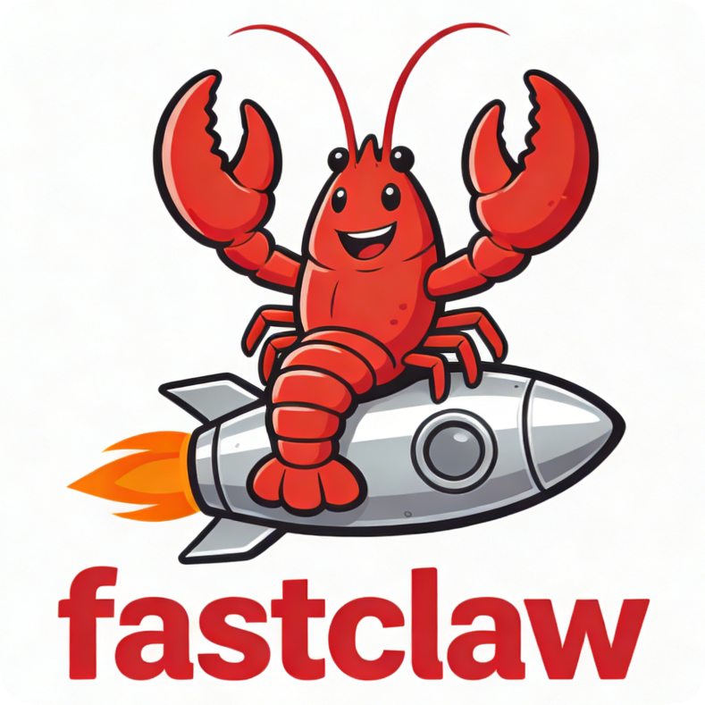

# Fastclaw

[English](./README.md) | 中文

Fastclaw 是一个基于 Rust 的本地 AI Agent，支持 OpenAI-Compatible 模型提供商、多通道交互（CLI 与钉钉）、流式输出、会话历史、定时任务执行和工具调用。

## 功能特性

- 基于 `tokio` + `rig-core` 的异步运行时
- OpenAI-Compatible 模型提供商接入
- 通道支持：
  - CLI 通道（`--channel Cli`）
  - 钉钉通道（`--channel Dingtalk`，默认 feature 启用）
- 支持推理流与最终回答流式输出
- 内置工具：
  - `shell`：在工作区执行 shell 命令
  - `current-time`：返回本地 RFC3339 时间
  - `task-list`、`task-create`、`task-detail-get`、`task-update`、`task-del`
  - `websearch`（仅在配置 `[websearch]` 后可用）
- 支持会话历史持久化与历史压缩（`/compact`）
- 内置 heartbeat 后台调度 cron 任务
- 一键初始化工作目录、默认配置和工作区模板

## 环境要求

- Rust stable（需支持 `edition = 2024`）
- Cargo
- 可访问的 OpenAI-Compatible API 服务

## 构建

```bash
git clone <your-repo-url>
cd fastclaw
cargo build
```

如果只需要 CLI，且希望避免钉钉依赖：

```bash
cargo build --no-default-features --features "model_provider_openai_compatible,channel_cli_channel,volcengine"
```

## CLI 命令

```bash
fastclaw <COMMAND>
```

可用子命令：

- `onboard init-config`：初始化工作目录与默认文件
- `start`：启动 Agent 运行时

示例：

```bash
cargo run -- --help
cargo run -- onboard init-config --help
cargo run -- start --help
```

## 快速开始

### 1. 初始化工作目录

默认工作目录是 `~/.fastclaw`：

```bash
cargo run -- onboard init-config
```

指定自定义路径：

```bash
cargo run -- onboard init-config --path /absolute/path/to/fastclaw-home
```

如果目录已存在，可加 `--rewrite`：

```bash
cargo run -- onboard init-config --path /absolute/path/to/fastclaw-home --rewrite
```

### 2. 编辑 `config.toml`

新生成的 `config.toml` 当前内容如下：

```toml
default_model_provider = ""
default_model = ""
default_show_reasoning = true

[agent_settings]

[model_providers]

[log_config]
level = "Info"

[log_config.logger]
logs_dir = "./logs"

[heartbeat_config]
interval = 60
```

最小可用示例：

```toml
default_model_provider = "openai"
default_model = "gpt-4.1-mini"
default_show_reasoning = true

[model_providers.openai]
provider_type = "OpenaiCompatible"
api_key = "sk-xxx"
api_url = "https://api.openai.com/v1"

[model_providers.openai.models.gpt-4.1-mini]
vision = true
audio = false
video = false
document = false
websearch = false
reasoning = true
tool = true
reranker = false
embedding = false
max_tokens = 65536

[heartbeat_config]
interval = 60

[log_config]
level = "Info"

[log_config.logger]
logs_dir = "./logs"
```

可选：配置 websearch（`volcengine` feature）：

```toml
[websearch]
type = "volcengine"
api_url = "https://<your-volcengine-endpoint>"
api_key = "<your-token>"
```

可选：配置钉钉（启用 `channel_dingtalk_channel` 时）：

```toml
[dingtalk_config.credential]
client_id = "..."
client_secret = "..."

[dingtalk_config.allow_session_ids]
"staff_id_or_group_key" = { Master = { val = "owner", settings = {} } }
```

### 3. 启动 Agent

```bash
cargo run -- start --channel Cli
```

指定工作目录：

```bash
cargo run -- start --channel Cli --workdir /absolute/path/to/fastclaw-home
```

## CLI 交互

启动后在 `>>` 输入消息。

控制命令：

- `/compact --ratio <0.2~1.0>`：压缩当前会话历史
- `/showreasoning on|off`：当前已解析但**尚未实现**（见“已知问题”）

每轮会显示 token 用量：

- `<<Tokens:total↑input↓output>>`

## 初始化目录结构

`onboard init-config` 会创建：

```text
<workdir>/
  config.toml
  db.sqlite
  workspace/
    AGENTS.md
    BOOTSTRAP.md
    HEARTBEAT.md
    IDENTITY.md
    MEMORY.md
    SOUL.md
    TOOLS.md
    USER.md
    cron/README.md
    memory/README.md
    sessions/README.md
    skills/README.md
    state/README.md
```

## 日志

`[log_config]` 支持：

- `level`：`Error` / `Warn` / `Info` / `Debug`
- `logger`：
  - `Stdout`
  - `File { logs_dir = "./logs" }`（相对路径会解析到 `<default_workdir>/logs`）

## 开发

```bash
cargo fmt
cargo clippy --all-targets --all-features
cargo test --all-features
```

## 已知问题

- `/showreasoning on|off` 目前会触发代码中的 `unimplemented!()`。
- CLI 通道下即使 `default_show_reasoning = false`，reasoning 文本本体仍会输出；当前只对头尾标记做了开关控制。
- `cargo test --all-features` 运行 `volcengine` websearch 测试时需要环境变量 `VOLCENGINE_WEBSEARCH_API_URL` 和 `VOLCENGINE_WEBSEARCH_API_KEY`。

## 说明

- `start --workdir` 必须指向已初始化且包含 `config.toml` 的目录。
- 日志目录不可写会导致启动失败。
- 若 `default_model_provider`、`default_model` 或 provider 对应模型配置缺失，Agent 创建会失败。
